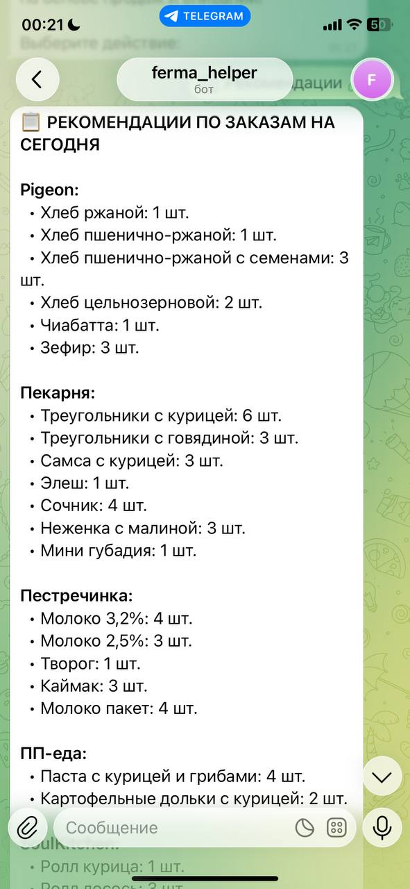
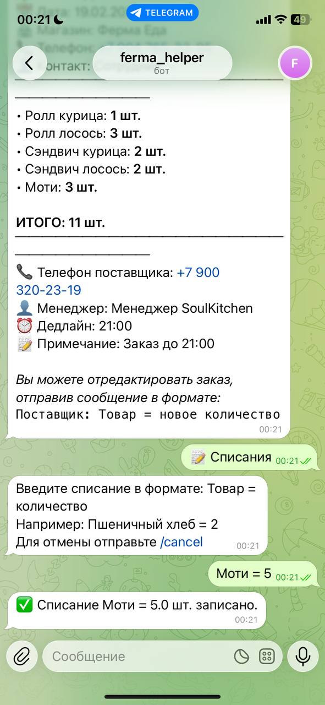
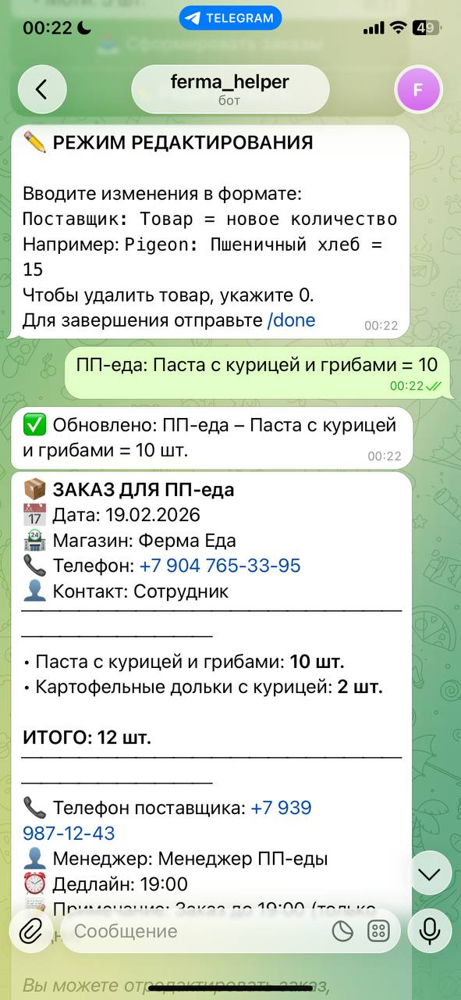
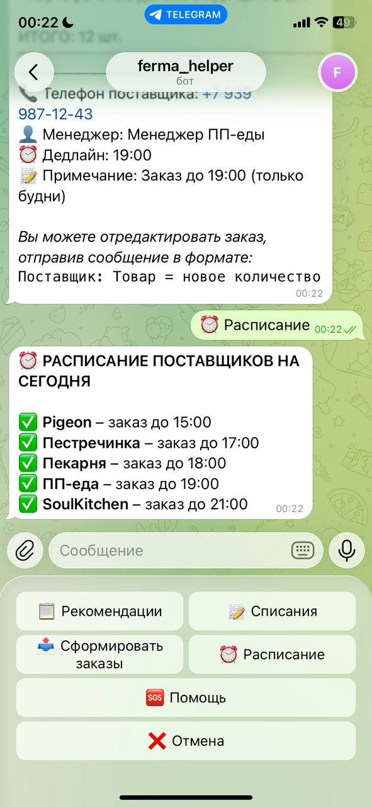
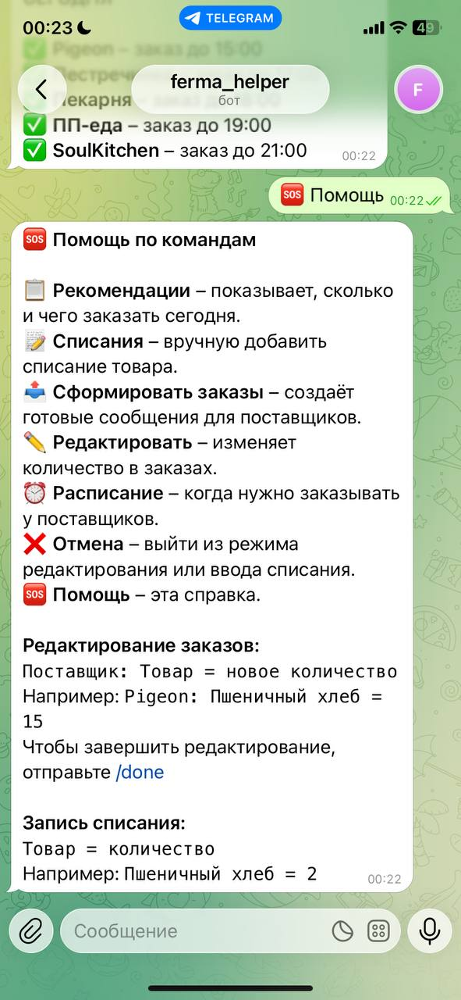

# FermaEda Bot

Telegram-бот для автоматизации закупок продуктов в магазине «Ферма Еда». Помогает рассчитывать оптимальные заказы поставщикам, учитывая историю продаж, списания, праздники и дни недели. Бот также напоминает о дедлайнах заказов, чтобы избежать забывчивости.

## 📌 Проблема и контекст

Я работала бариста и кассиром в небольшом продуктовом магазине. В мои обязанности входило ежедневное формирование заявок поставщикам. Главная сложность – предугадать, сколько товара заказать, чтобы:

- Всем покупателям хватило;
- Бариста хватало молока для кофе и на утро до свежей поставки;
- Продукты не списывались (срок годности большинства – всего 2 дня).

Ошибки случались часто: из-за перебора товары списывались, из-за недобора покупатели уходили недовольны, а иногда я просто забывала сделать заказ вовремя. Нужно было решение, которое автоматизирует расчёты и не даст пропустить дедлайн.

## 🚀 Решение – Telegram-бот

Бот, интегрированный с базой данных продаж и списаний, самостоятельно рассчитывает, сколько каждого товара заказать сегодня, и отправляет готовые сообщения поставщикам. Он учитывает:

- Историю продаж (последние 30 дней);
- Списания (как неудовлетворённый спрос);
- День недели (в среду/четверг продажи выше, в выходные – ниже);
- Праздничные дни (спрос возрастает);
- Текущие остатки товаров.

## 🧩 Основные функции

- **📋 Рекомендации** – бот анализирует данные и выдаёт список товаров с необходимым количеством для каждого поставщика.
- **📝 Списания** – сотрудник может вручную добавить списание товара (например, если что-то испортилось). Эти данные учитываются в будущих прогнозах.
- **📤 Сформировать заказы** – бот создаёт готовые сообщения для поставщиков с контактами магазина.
- **✏️ Редактировать** – возможность скорректировать заказ прямо в чате (например, увеличить количество молока).
- **⏰ Расписание** – показывает, у каких поставщиков сегодня дедлайн заказа и до какого времени.
- **🆘 Помощь** – краткая справка по командам.
- **🔔 Напоминания** – бот присылает уведомление за 10 минут до дедлайна каждого поставщика.

## 🛠 Технический стек

- **Язык:** Python 3.12
- **Библиотеки:** python-telegram-bot, pytz, holidays, sqlite3
- **База данных:** SQLite (таблицы продуктов, продаж, списаний, остатков, заказов)
- **Логика прогноза:** учитывает средние продажи за аналогичные дни недели + списания + праздничный коэффициент.

## 📁 Структура проекта и назначение файлов

- **procurement_bot/** – корневая папка проекта
  - `bot.py` – главный файл бота: обработчики команд, кнопок, диалогов, запуск и планировщик напоминаний.
  - `config.py` – конфигурация: токен бота, ID администратора, контакты поставщиков, расписание, праздники, путь к БД.
  - `database.py` – модуль для работы с SQLite: создание таблиц, добавление и получение данных (продажи, списания, остатки, товары).
  - `utils.py` – вспомогательные функции: прогноз спроса, расчёт рекомендаций, проверка праздников, форматирование сообщений для поставщиков.
  - `requirements.txt` – список зависимостей Python для установки.
  - `README.md` – документация проекта.
  - `data/` – папка для файлов данных
    - `procurement.db` – файл базы данных SQLite

## 📦 Локальный запуск

1. Клонируйте репозиторий:
   bash
   git clone https://github.com/sylu-id/fermaeda-bot.git
   cd fermaeda-bot/procurement_bot

2. Создайте виртуальное окружение: 
   python3 -m venv venv
   source venv/bin/activate  # для Mac/Linux
   .\venv\Scripts\activate  # для Windows

3. Установите зависимости
   pip install -r requirements.txt

4. Настройте config.py – вставьте свой токен бота и ID администратора.

5. Запустите бота:
   python bot.py
   
## 📸 Демонстрация работы

| | |
|:---:|:---:|
| **Главное меню** | **Рекомендации по заказам** |
|  |  |
| **Сформированный заказ для Pigeon** | **Ввод списания** |
|  |  |
| **Режим редактирования** | **Расписание поставщиков** |
|  |  |
| **Справка** | |
|  | |

## 📈 Результаты и влияние

За первый месяц использования MVP бота списания продуктов снизились на **30%**. Персонал перестал забывать о дедлайнах, заказы стали точнее, а покупатели реже сталкивались с отсутствием нужных товаров.

## Планы на будущее

- **Развернуть модель машинного обучения в облаке** – перенести расчёты с локального компьютера на облачную платформу (например, Render или AWS). Это обеспечит бесперебойную работу 24/7, автоматическое обновление прогнозов на основе вчерашних продаж и масштабируемость без участия человека.
- **Снизить списания продуктов на 40%** – за счёт более точного прогнозирования спроса с учётом сезонности, праздников и дней недели планируется сократить объём списываемых товаров до минимума.
- **Увеличить выручку на 30%** – благодаря оптимальному наличию товаров на витрине (особенно молочной продукции и выпечки) и сокращению дефицита, что напрямую повлияет на рост продаж.
- **Снизить риск пропуска заказа до <1%** – внедрение автоматических напоминаний и резервного копирования данных исключит человеческий фактор (забывчивость, невнимательность) и обеспечит своевременную подачу заявок поставщикам.
- **Автоматизировать сбор данных из кассовой системы** – чтобы бот самостоятельно забирал информацию о продажах из СБИС или другой учётной системы, полностью исключив ручной ввод.
- **Создать дашборд для руководства** – веб-интерфейс с ключевыми метриками: динамика списаний, выполнение заказов, точность прогнозов, что поможет принимать стратегические решения.

## 📄 Лицензия

Проект распространяется под лицензией MIT.

Если у вас есть вопросы или предложения, свяжитесь со мной:
Tansylu – tansiluhb@gmail.com